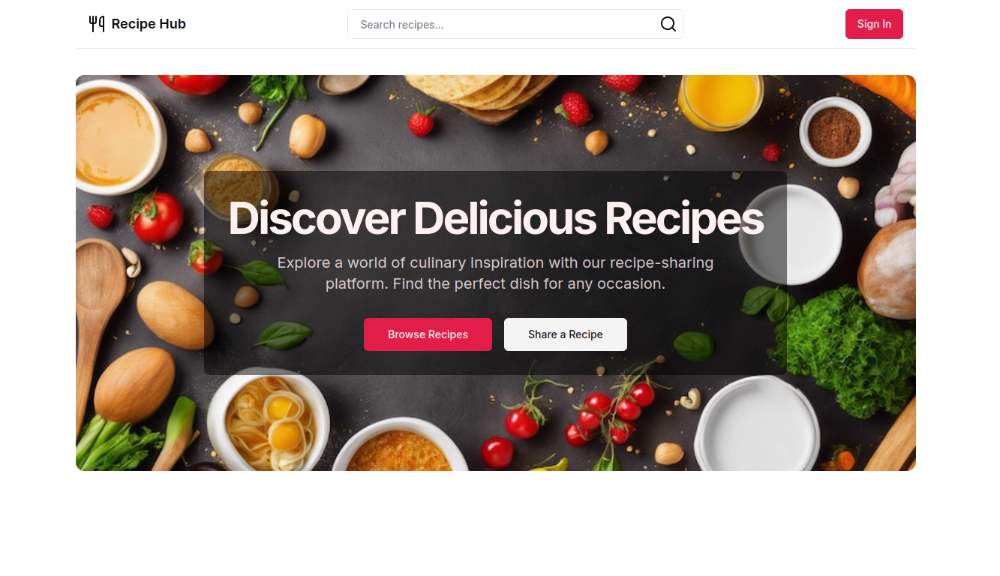

# RecipeHub - Recipe Sharing Platform
Welcome to the RecipeHub wiki! This is the official documentation for the RecipeHub recipe-sharing platform. Here, you'll find an overview of the project, how to get started, the current status, and guidelines for contributing.

Table of Contents

* [Introduction](#introduction)
* [Features](#features)
* [Technology Stack](#technology-stack)
* [Installation & Setup](#installation_setup)
* [Folder Structure](#folder-structure)
* [API Documentation](#api-documentation)
* [Roadmap](#roadmap)
* [Contributing](#contributing)

# Introduction <a name = "introduction"></a>

RecipeHub is a platform where users can share and explore recipes. Whether you are a professional chef or just a home cook, RecipeHub offers a user-friendly experience to create, discover, and share culinary masterpieces. The platform supports features like image uploads, recipe categorization, and user interaction through ratings and comments.

# Features <a name = "features"></a>

* User authentication (sign up, log in)
* Add, update, and delete recipes
* Recipe categories and tags
* Image upload for recipes
* User profile management
* Rating and commenting on recipes
* Search functionality to find recipes by name, category, or tags

# Technology Stack <a name = "tech_stack"></a>

* Frontend: Next.js, React, TypeScript
* Backend: Node.js, Prisma, PostgreSQL
* Authentication: NextAuth.js
* Storage: Supabase for image hosting
* Database: PostgreSQL (via Prisma ORM)
* UI Components: Tailwind CSS, Radix UI
* Deployment: Vercel

# Installation & Setup  <a name = "installation_setup"></a>

## Prerequisites

Ensure you have the following installed:

* Node.js (v16+)
* PostgreSQL
* Supabase account (for image hosting)

# Steps to run the project

### 1. Clone the repository:

```
git clone https://github.com/TajwarSaiyeed/recipehub-recipe-sharing-platform.git
cd recipehub-recipe-sharing-platform
```

### 2. Install dependencies:

```
npm install
```

### 3. Set up environment variables:

Create a .env file in the root directory and add your environment variables:

```
DATABASE_URL=your_postgresql_database_url
NEXT_PUBLIC_SUPABASE_URL=your_supabase_url
NEXT_PUBLIC_SUPABASE_ANON_KEY=your_supabase_anon_key
NEXTAUTH_URL=your_application_url
```

### 4. Run the development server:
```
npm run dev
```

### 5. Open the app at http://localhost:3000.

# Folder Structure <a name = "folder-structure"></a>

```
.
├── components      # Reusable UI components
├── pages           # Next.js pages and API routes
├── prisma          # Prisma schema and migrations
├── public          # Public assets like images
├── styles          # Global stylesheets
├── utils           # Helper functions and utilities
└── README.md       # Project overview and instructions
```

# API Documentation <a name = "api-documentation"></a>

```
Pending ....
```

# Roadmap <a name = "roadmap"></a>

1. Implement basic recipe CRUD operations
1. Add authentication with NextAuth.js
1. Image upload support via Supabase
1. Implement user profile management
1. Add social sharing options
1. Improve search functionality
1. Build mobile responsiveness

***

# Contributing <a name = "contributing"></a>

We welcome contributions! Please follow these steps:

* Fork the repository.
* Create a new feature branch: ```git checkout -b feature/your-feature.```
* Commit your changes: ```git commit -m 'Add your feature'.```
* Push to the branch: ```git push origin feature/your-feature.```
* Open a pull request.